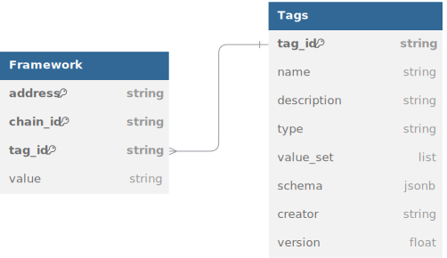

# Open Labels Initiative: Data Model

## Data Model
Labelling is performed by assigning a pre-defined `tag_id` with a `value` to an `address` & `chain_id` combination. Each address can have as many tags assigned as it wants, but each `tag_id` can only be assigned once per `address`.

* `address`: the hexadecimal public address of a smart contract or externally owned account (EOA)
* `chain_id`: unique identifier as defined by [CAIP-2](https://github.com/ChainAgnostic/CAIPs/blob/main/CAIPs/caip-2.md), which includes the [EIP-155](https://github.com/ethereum/EIPs/blob/master/EIPS/eip-155.md) standard. Allows for referencing non-EVM chains such as Bitcoin, Starknet and Solana.
* `tag_id`: tag IDs represent a wide range of concepts. For OLI-compliant tags, please refer to [tag_defintions.yml](tags/tag_definitions.yml). We encourage anyone to submit a PR to contribute new tags to the framework. The framework also allows for other tag ID namespaces for more detailed internal labelling.
* `value`: Each `tag_id` has a value field that specifies the content of the tag applied.



## Tags

Each `tag_id` is linked to a `value` in the OLI-framework, allowing it to flexibly represent complex concepts. The definition of each `tag_id` is stored in the [tag_definitions.yml](tags/tag_definitions.yml) file, which contains key information such as `name`, `description` and `creator` for each `tag_id`.

- **`tag_id`**: unique identifier for the tag
- **`name`**: descriptive name of the tag
- **`description`**: short explanation of what the tag represents
- **`type`**: data type of the value associated with this tag
- **`value_set`** (optional): predefined value set or URL to an external value set
- **`creator`**: entity responsible for creating the tag
- **`version`**: version of this `tag_id`

These tags will be expanded based on the need from the community.

Tags prefixed with an underscore (e.g., `_source`) do not describe the address or contract itself, but rather provide metadata about the label that is being submitted.

### Predefined `value_set`
Certain tags can only take values from predefined value sets. Examples of such tags include the `tag_ids`: `oli.owner_project` and `oli.usage_category`. 

These predefined value sets can reside and be maintained in the OLI GitHub repository under the [tags/valuesets](tags/valuesets) folder or in external directories.

#### External `value_set`
An example of an external `value_set` is `tag_id` = `oli.deployer_project`, which uses the names from the [OSS-directory](https://github.com/opensource-observer/oss-directory/tree/main) as unique identifiers for projects.

#### Internal `value_set`
An example of an internal `value_set` is `tag_id` = `oli.usage_category`, for which we defined a value set to ensure standardization. The full list with the hierarchical mapping can be found [here](tags/valuesets/category_definitions.yml). The OLI-maintained value sets are community-based and can be expanded through a PR.

# Example OLI Compliant Datasets
Datasets can be stored according to the defined Data Model above, or the `tag_id` can be pivoted into columns, which is particularly useful when not all `tag_id`s are relevant for a data team.

We have uploaded some OLI compliant sample data (`tag_id` is pivoted into columns) for [OP Mainnet (eip155-10)](./sample_data/op-mainnet_top_100_contracts_by_txcount_2024_07_24.json) and [Base (eip155-8453)](./sample_data/base_top_100_contracts_by_txcount_2024_07_24.json).

A short excerpt:
```
[
    {
        "address": "0xdC6fF44d5d932Cbd77B52E5612Ba0529DC6226F1",
        "chain_id": "eip155:10",
        "name": "WLD",
        "owner_project": "worldcoin",
        "usage_category": "fungible_tokens",
        "deployment_tx": "0x3f3231f6f4a036901a06d79a92ef7ffaedc81a8470126f4fdb436f7a57213de8",
        "deployer_address": "0x36BDE71C97B33Cc4729cf772aE268934f7AB70B2",
        "deployment_date": "2023-07-19 13:51:49"
    },
    {
        "address": "0x087000A300DE7200382b55D40045000000E5d60E",
        "chain_id": "eip155:10",
        "name": "Aggregate3",
        "owner_project": "worldcoin",
        "usage_category": "airdrop",
        "deployment_tx": "0xdd0f9cfb373020dd8d71c22d0853ac5d3ba1911ead94177ee09737f74a18b3d2",
        "deployer_address": "0x7d896339A80DD38bC3BbB04383894C62b2eF2585",
        "deployment_date": "2023-09-23 19:55:13"
    }
]
```