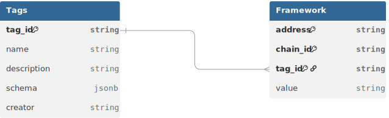

# Open Labels Initiative: Label Schema

## Label Schema
Labelling is performed by assigning a pre-defined `tag_id` with a `value` to an `address` & `chain_id` combination. Each address can have as many tags assigned as it wants, but each `tag_id` can only be assigned once per `address`.



* `address`: the hexadecimal public address of a smart contract or externally owned account (EOA)
* `chain_id`: unique identifier as defined by [CAIP-2](https://github.com/ChainAgnostic/CAIPs/blob/main/CAIPs/caip-2.md), which includes the [EIP-155](https://github.com/ethereum/EIPs/blob/master/EIPS/eip-155.md) standard. Allows for referencing all EVM & some non-EVM chains such as Base (`eip155:8453`), Arbitrum (`eip155:42161`) or Starknet (`SN_MAIN`) to name a few. 
To support labeling EOAs that may operate across multiple EVM-compatible chains, the special value `eip155:any` is permitted as `chain_id`. However, it should be used with caution especially for labeling smart contracts, as contracts can share the same address across chains but serve different purposes.
* `tag_id`: Tag IDs can represent a wide range of things. For OLI-compliant tags, refer to [tag\_definitions.yml](tags/tag_definitions.yml). We very much encourage contributions via PRs to expand the OLI Label Schema. The use of custom, non-OLI-compliant `tag_id`s is possible, though not recommended. If you choose to use your own namespace, we suggest using a clear and descriptive identifier e.g.`custom_namespace.custom_tag_id`.
* `value`: Each `tag_id` has a value field that specifies the content of the tag applied.

### Tag IDs

Each `tag_id` is linked to a `value` in the OLI Label Schema, allowing it to flexibly represent complex concepts. The definition of each `tag_id` is stored in the [tag\_definitions.yml](tags/tag_definitions.yml) file, which contains key information such as `name`, `description`, `schema` and `creator` for each `tag_id`.

* `tag_id`: unique identifier for the tag
* `name`: descriptive name of the tag
* `description`: short explanation of what the tag represents
* `schema`: defines the data type, structure and validation rules for the value associated with this tag
* `creator`: entity responsible for creating the tag

These tags will be expanded based on the need from the community.

Tags prefixed with an underscore (e.g., `_source` & `_comment`) do not describe the address or contract itself, but rather provide information about the label that is being submitted.

### Tag ID Schema

The `schema` field within each `tag_id` in [tag\_definitions.yml](tags/tag_definitions.yml) defines the structure and validation rules for the values associated to the `tag_id`. It can include:

* **Data types**: Using `type` the data type of the `tag_id` can be defined. Possible types: boolean, integer, string, array, object. In case object is choosen, `properties` need to be defined. In case array is set, `items` needs to be defined.
* **Format constraints**: Using `format` length restrictions (minLength, maxLength) or string format specifications (date-time, uri, date) can be specified.
* **Description**: A `description` can be added to explain the `schema` of the `tag_id`.
* **Value sets**: Value sets with predefined values can be specified using `enum` followed by an array. For OLI-maintained or external-maintained value sets `enum_uri` can be set pointing to the external set of values via an URI.

**Value Sets**

Certain `tag_id`s can only take values from predefined value sets, which can be defined in three different ways:

1. **Defined in OLI Label Schema**: Using `enum` value sets are defined from an array of options inside [tag\_definitions.yml](tags/tag_definitions.yml).
2. **OLI-maintained**: Referenced via `enum_uri`, linking to a value set within the OLI Label Schema repository.
3. **External-maintained**: Referenced via `enum_uri`, linking to a value set maintained outside the OLI Label Schema repository by a 3rd party.

[OLI-maintained value sets](tags/valuesets) are community-based and can be expanded via PRs in this repo, while external-maintained rely on authoritative sources maintained by other organizations.

# Example of OLI Compliant Labels
Datasets of OLI compliant labels can be stored according to the defined Label Schema above, or the `tag_id` can be pivoted into columns, which is particularly useful when not all `tag_id`s are relevant for a user.

We have uploaded some OLI compliant sample data (`tag_id` is pivoted into columns) for [OP Mainnet (eip155:10)](./sample_data/op-mainnet_top_100_contracts_by_txcount_2024_07_24.json) and [Base (eip155:8453)](./sample_data/base_top_100_contracts_by_txcount_2024_07_24.json).

A short excerpt:
```
[
    {
        "address": "0xdC6fF44d5d932Cbd77B52E5612Ba0529DC6226F1",
        "chain_id": "eip155:10",
        "contract_name": "WLD",
        "owner_project": "worldcoin",
        "usage_category": "fungible_tokens",
        "deployment_tx": "0x3f3231f6f4a036901a06d79a92ef7ffaedc81a8470126f4fdb436f7a57213de8",
        "deployer_address": "0x36BDE71C97B33Cc4729cf772aE268934f7AB70B2",
        "deployment_date": "2023-07-19 13:51:49"
    },
    {
        "address": "0x087000A300DE7200382b55D40045000000E5d60E",
        "chain_id": "eip155:10",
        "contract_name": "Aggregate3",
        "owner_project": "worldcoin",
        "usage_category": "airdrop",
        "deployment_tx": "0xdd0f9cfb373020dd8d71c22d0853ac5d3ba1911ead94177ee09737f74a18b3d2",
        "deployer_address": "0x7d896339A80DD38bC3BbB04383894C62b2eF2585",
        "deployment_date": "2023-09-23 19:55:13"
    }
]
```
