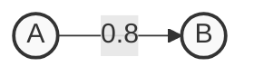
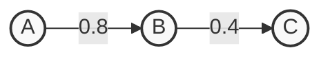
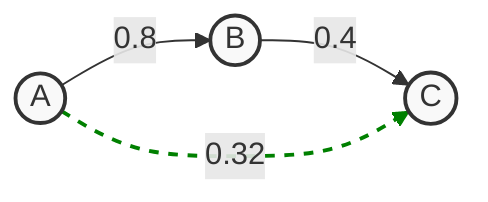

# Open Labels Initiative: Label Trust

The OLI Label Pool is a community platform where anyone can contribute labels to. Because of this open-source nature, we need a way to ensure the quality and trustworthiness of the data when reading labels out of the Label Pool. This is where Label Trust comes in.

Label Trust is a product that allows you to extract only the highest-quality labels from the pool. We achieve this by applying a transitive trust algorithm, which builds a trust network among all attesters, allowing you to assign confidence scores to all labels based on one source node. This ensures that even though anyone can add labels, you can confidently use the most trusted data for your specific needs.


## Trust Table

A trust table is a list of attester addresses and a confidence score from 0 to 1 (1 being fully trusted and 0 being not to be trusted). Each trusted attester can further be assigned different topics of trust, those being chain_id and the other being tag_id. This allows for more granular trust assigning of each attester.

Example of a trust table:

| attester | tag_id | chain_id | confidence |
|---------|-----------|-------|-------|
| 0x8dba...9192 | deployment_block | * | 0.9 |
| 0xe7d1...33ee | is_paymaster | * | 0.7 |
| 0x3e22...b6ee | * | * | 0.5 |
| 0x10db...4047 | is_paymaster | eip155:48900 | 0.25 |
| 0x10db...4047 | * | eip155:48900 | 0.2 |
| 0xc139...040e | * | * | 0.1 |


## Transitive Trust Explained

The transitive trust algorithm is based on a [paper by the Ethereum Attestation Service](https://attest.org/Transitive-Trust.pdf), with only small deviations.

Since each node in the network maintains its own trust table publicly, anyone can create a web of trust edges.

Let $\mathbf{A}$, $\mathbf{B}$, and $\mathbf{C}$ be attesters in the network.

#### 1\. Direct Trust

Let's assume $\mathbf{A}$ trusts $\mathbf{B}$ with 0.8 confidence.



#### 2\. Transitive Trust

Further, let's assume $\mathbf{B}$ trusts $\mathbf{C}$ with a confidence of 0.4.



#### 3\. Transitive Trust Table

Utilizing the transitive trust algorithm, we can now create the trust graph from the point of view of $\mathbf{A}$.



This table includes $\mathbf{B}$ (direct trust), but also $\mathbf{C}$ to a certain degree. Since $\mathbf{B}$ trusts $\mathbf{C}$, $\mathbf{A}$ can "transitively" trust $\mathbf{C}$. This is calculated by multiplying the confidence values along the path:

$$0.8 \times 0.4 = 0.32$$

The final calculated trust table from $\mathbf{A}$'s perspective will look like this:

| Attester | Trust Type | Confidence |
| :--- | :--- | :--- |
| $\mathbf{B}$ | Direct | 0.8 |
| $\mathbf{C}$ | Transitive | 0.32 |


That is a critical point\! Without trusting yourself, the transitive graph has no starting point (no "anchor"). You are the root of your own trust web.


## Creating Your Trust Table

To create your own trust table, start by copying the [yml template](https://www.google.com/search?q=trust_table_template.yml) located in this folder.

Below is an example configuration. Note the first entry establishes Self-Trust.

```yaml
owner_name: "template_trust_table"
attesters:
  # --- STEP 0: SELF TRUST (THE ANCHOR) ---
  # You must trust yourself to start the chain.
  - address: "0xYOUR_OWN_WALLET_ADDRESS"
    description: "Me (Root)"
    confidence: 1.0

  # --- MODE 1: SIMPLE TRUST ---
  # Trust everything this address says with a flat confidence score.
  - address: "0xA725646c05e6Bb813d98C5aBB4E72DF4bcF00B56"
    description: "growthepie attest"
    confidence: 0.8 

  # --- MODE 2: FILTERED TRUST (TAGS) ---
  # Trust this address differently based on the topic (tag).
  - address: "0xE7d1405C20A23a8e8f9F1BD572d1320c479233EE"
    description: "0xKofi"
    filters:
      - tag_id: "is_paymaster"
        confidence: 0.7
      - tag_id: "is_bundler"
        confidence: 0.7
      # Use the wildcard '*' to set a default confidence for 
      # any tag not explicitly listed above.
      - tag_id: "*"
        confidence: 0.4

  # --- MODE 3: HYPER-SPECIFIC TRUST (CHAIN + TAG) ---
  # Trust this address only for a specific contract on a specific chain.
  - address: "0x10dBAc4d35f4aD47E85f70c74e4449c632EC4047"
    description: "Krzys Tech"
    filters:
      - tag_id: "contract_name"
        chain_id: "eip155:48900" 
        confidence: 0.25
```

The `trust_table_template.yml` file is structured with top-level fields followed by the nested attester list, which contains the details of each trusted entity.

**Top Level Fields**

| Field | Type | Description |
| :--- | :--- | :--- |
| `owner_name` | String | A unique identifier for your specific trust table. |
| `attesters` | List/Array | The primary list containing all trusted attester nodes and their associated trust definitions. |

**Attester List Fields**

Each item within the `attesters` list (representing a single entity you trust) must contain an address and confidence, and may optionally contain filters.

| Field | Type | Description |
| :--- | :--- | :--- |
| `address` | String | The EVM address of the attester node (the party you are choosing to trust). |
| `description` | String | (Optional) A human-readable note or explanation identifying who controls this address (e.g., "growthepie"). |
| `confidence` | Float | A confidence score between $0.0$ and $1.0$ that applies to this attester for all topics, unless overridden by a specific filter. |
| `filters` | List/Array | (Optional) A list of rules that allow you to define granular trust based on the topic (`tag_id` or `chain_id`). |

### Common Errors

Error:
`Error adding private trust list: The node 0x_YOUR_ADDRESS is not in the digraph.`

Explanation:
This error occurs when your trust graph has no starting point. The source address for the trust graph is automatically set to the public address derived from your private key. If you do not include your own wallet in your trust list, the graph has nowhere to begin, so your address does not appear in the trust graph. Make sure to add your own wallet address to your trust list.

## Using Your Trust Table

To activate and utilize your trust list, you must attest it on the EAS Schema. To do this, we highly recommend using the official OLI Python package: `oli-python`.

**Documentation on how to use the Python package to attest your trust list can be found [here](https://github.com/openlabelsinitiative/oli-python?tab=readme-ov-file#oli-label-trust).**

In regards to the privacy of your trust list, you have two options:

1.  Attest Publicly: We strongly recommend attesting your trust list publicly. By doing so, you allow everyone to use your trust relationships to build a more robust and interconnected transitive trust graph. This option is required if you want to utilize your trust list inside the [OLI-SDK](https://github.com/openlabelsinitiative/oli-sdk).
2.  Keep Your List Private: You can choose to keep your trust list locally within the Python package and build the trust graph without publicly exposing your list.
