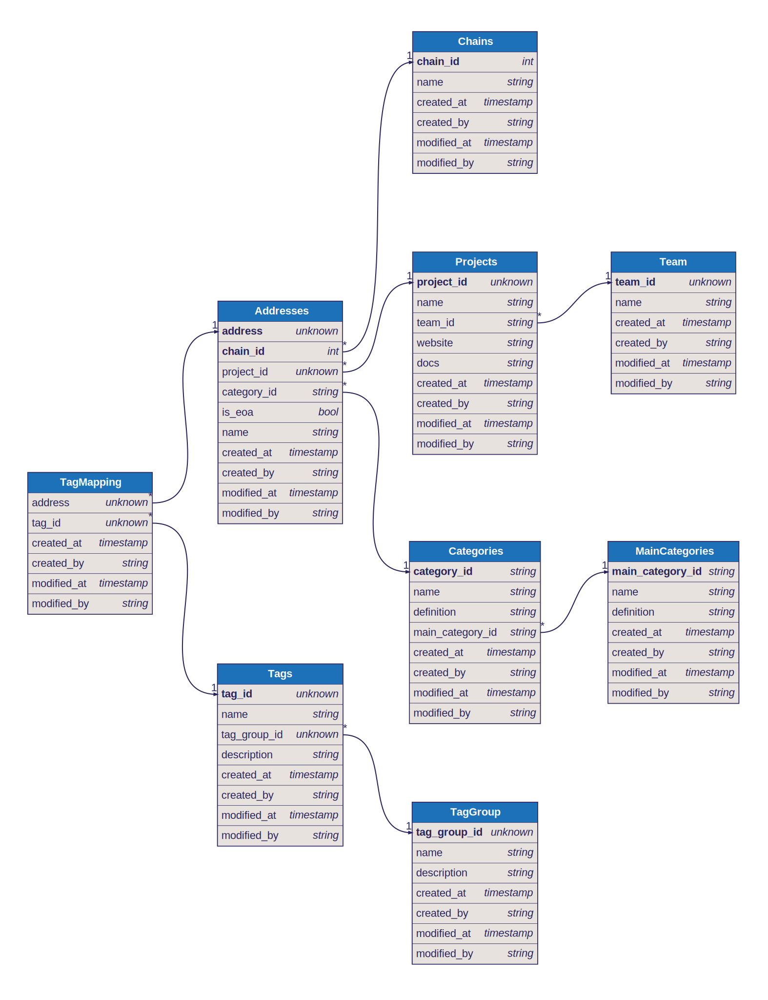

# Open Labels Initiative
*A standardized framework and data model for EVM address labeling*

[dbdocs](https://dbdocs.io/matthias/OpenLabelsInitiative)

## Goal
We aim to tackle the issue of isolated and non-standardized contract and wallet labeling datasets within the blockchain data community. By introducing a standardized data model for smart contract and wallet labels we advocate for the consolidation into a single, universally accessible data structure utilized by various data providers. Additionally, we also aim to function as an aggregator for labelling tools (i.e. automated ERC detection, activity tagging, etc.)

The Ethereum Foundation funded this effort as part of the [Data Collection Grants](https://esp.ethereum.foundation/data-collection-grants). This standardized data structure was part of their [wish list](https://notes.ethereum.org/@drigolvc/DataCollectionWishlist) but other foundations and data teams also expressed interest in the past (as discussed [here](https://twitter.com/tokenterminal/status/1694103939602608540) by TokenTerminal and MSilb7). 

## Data model
This is the current suggestion for the data model. The full dbml definition can be found [here](https://github.com/openlabelsinitiative/oli/blob/main/data_model.dbml).
This link shows the interactive dbdiagram: [https://dbdiagram.io/d/OLI-65c538c3ac844320aec4000e](https://dbdiagram.io/d/OLI-65c538c3ac844320aec4000e)

## Tooling
WIP: repository of references to labelling tools

## Datasets 
OLI won’t store any datasets. This initiative's goal is to align on a standardized data structure for labels which will make it easier to sync different datasets. Databases will still be in the hands of the different data teams. growthepie and walletlabels commit to making their data publicly available via API endpoints and hope that other data teams will join this effort for democratized access to address labels. 

## Contributors
### Founding members
These teams applied for grants with the Ethereum Foundation and started building out the core structure.
- [growthepie](https://www.growthepie.xyz/): Layer 2 analytics platform with focus on labelling smart contracts on layer 2s.

- [walletlabels](https://www.walletlabels.xyz/): Wallet labeling platform with focus on labels for Ethereum as well as social labels / labeling of EOAs.

### Sponsors
- [Ethereum Foundation](https://ethereum.foundation/)

### Other Contributors
Other data teams that are involved in active feedback for this initiative and/or opened up their labeled databases.
- [OP Labs](https://www.oplabs.co/)
- TBD
