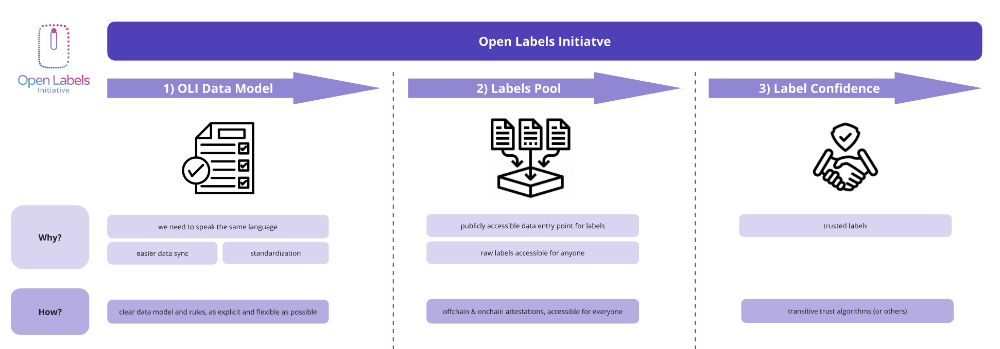

# Open Labels Initiative
***A standardized framework and data model for address labeling.***

Upcoming community calls can be found in our [Google Calendar](https://calendar.google.com/calendar/u/3?cid=MmQ0MzYxNzQ3ZGFiY2M3ZDJkZjk0NjZiYmY3MmNmZDUwZTNjMjE2OTQ4YzgyNmI4OTBmYjYyN2VmNGRjNjQ4OEBncm91cC5jYWxlbmRhci5nb29nbGUuY29t)!

## Goal
This initiative tackles the issue of isolated and non-standardized datasets of address labels within the blockchain community. It introduces a flexible, open and community owned framework for anyone to use and contribute to. 

By aligning on a single framework for address labels, we avoid redundant work and make it easier to share datasets within the community.

The OLI repository functions as the community maintainer. Additionally, it serves as a neutral entity that provides tooling to get started.

## The 3 Pillars of OLI Framework
  - **1) Data Model:** We should all speak the same language when it comes to labels. The first step is implementing a unified data model that enables seamless synchronization of labels across different databases and ensures alignment on value sets. More details in [1_data_model](/1_data_model/README.md).
  - **2) Label Pool:** Sharing labels in a decentralized manner is the next logical step. Using attestations, we've created a pool of raw labels that anyone can contribute to. By consolidating all labels in one place, both labellers and data teams can share their work, reducing redundant work. All attestations will remain permanently accessible, fostering a collaborative, community-driven labeling effort. More details in [2_label_pool](/2_label_pool/README.md)
  - **3) Label Confidence:** Trust algorithms optimized for specific use cases are applied to the raw labels contributed to the Label Pool. In doing so, raw labels are transformed into valuable, use-case-specific labels—optimized for analytics, security and beyond. More details coming soon in [3_label_confidence](/3_label_confidence/README.md).

## Products Using OLI
- [growthepie - Smart Contract Explorer](https://labels.growthepie.com/)
- [growthepie - Applications Page](https://www.growthepie.com/applications/)
- [Agnostic - Public Data Warehouse](https://agx.app/)
- [Sourcify - Verified Contract Repository](https://repo.sourcify.dev/)
- [Enscribe - Tool to Assign ENS to contracts](https://app.enscribe.xyz/)
- ...
- *please list your projects here*

## Frequently Asked Questions (FAQ)

  
<strong>This sounds great, how can I get started / participate?</strong>

  Great to hear! To stay updated on the latest happenings, feel free to join our [monthly OLI calls](https://calendar.google.com/calendar/u/3?cid=MmQ0MzYxNzQ3ZGFiY2M3ZDJkZjk0NjZiYmY3MmNmZDUwZTNjMjE2OTQ4YzgyNmI4OTBmYjYyN2VmNGRjNjQ4OEBncm91cC5jYWxlbmRhci5nb29nbGUuY29t). You can also start submitting labels through our [frontend](https://www.openlabelsinitiative.org/attest) or by using one of our [bulk attestation scripts](2_label_pool/tooling_write/). If you’re just interested in reading labels from the label pool, you can access them via a [GraphQL endpoints](2_label_pool/tooling_read/graphql_python).

  
<strong>Who will submit labels to the OLI Label Pool?</strong>

  We identified three core user groups among label submitters, which primarily differ in the volume of labels they contribute.

| Submitter                | Volume        | Description | Entry method
  |------------------------|--------------------|-------------|------------
  | **High-volume labelers** | High (1000+)       | Data teams & indexing companies that have automated and highly optimized scripts running to label a high number of smart contracts. | pip package or typescript script |
  | **Casual labelers**      | Medium (5-1000)    | Individuals who have a set of labels they want to submit. Could be analysts collecting labels manually or dApp teams that deployed multiple contracts and want to share metadata. | OLI frontend end or pip package |
  | **Single labelers**      | Low (1-5)         | Individuals submitting a very small amount of labels, usually smart contract deployers who want to make metadata on their smart contract available. | OLI front end |

  
<strong>Why should I submit my labels to the OLI label pool?</strong>

  This is a public, open initiative designed to break down data silos and empower everyone with higher-quality labels. The more people who contribute, the higher the quality of the labels—and the more possibilities they unlock.

  While OLI itself will not sponsor participants, we aim to maintain complete transparency about the number of labels contributed by different teams and individuals. This transparency can serve as a qualifying factor for public goods funding rounds such as Gitcoin, Optimism Retro Funding, Octant, and many more.

  
<strong>Why do you use attestations for data entry / label submission?</strong>

  Attestations are a powerful tool for standardizing data entry while cryptographically verifying who submitted each label. This enables anyone to build robust trust algorithms that boost confidence in the submitted labels.

  
<strong>Can every label in the label pool be blindly trusted?</strong>

  No. Currently, these labels are raw and haven't undergone any additional trust verification. A straightforward trust layer involves relying solely on labels submitted by verified, whitelisted entities — a process made easy since every label is associated with an attestation. Looking ahead, we plan to develop trust algorithms tailored to specific use cases. All future tools related to this will be made available [here](3_label_confidence).

  
<strong>I want to submit metadata, but I couldn't find a fitting tag in the data model. What should I do?</strong>

  Great! Simply open a pull request to our [tag_definitions.yml](1_data_model/tags/tag_definitions.yml) file in this repository and include an explanation for why this tag should be added to OLI. We'll periodically review all new tags and incorporate them into the schema.

  
<strong>How can I access the labels in the OLI Label Pool?</strong>

  There are multiple ways to access all labels in the OLI Label Pool, please see [tooling documentation](2_label_pool/README.md).

## Contributors
- [growthepie](https://www.growthepie.xyz/): Ethereum & Layer 2 analytics platform with focus on labeling smart contracts in terms of their usage and project owners.

### Sponsors

The [Ethereum Foundation](https://ethereum.foundation/) funded this effort as part of the [Data Collection Grants](https://esp.ethereum.foundation/data-collection-grants). This standardized data structure was part of their [wish list](https://notes.ethereum.org/@drigolvc/DataCollectionWishlist) and other foundations and data teams also expressed interest in the past.

### Other Supporters
Individuals or data teams that are involved in active feedback for this initiative and/or opened up their labeled databases.

- [walletlabels](https://www.walletlabels.xyz/): Wallet labeling platform with focus on labels for Ethereum as well as social labels / labeling of EOAs.
- [Carl Cervone](https://github.com/ccerv1) & [Raymond Cheng](https://github.com/ryscheng) | [Open Source Observer](https://github.com/opensource-observer)
- [Hildobby](https://x.com/hildobby_) | [Dragonfly](https://x.com/dragonfly_xyz)
- [Michael Silberling](https://github.com/MSilb7) | [OP Labs](https://www.oplabs.co/)
- [Storm](https://github.com/sslivkoff) & [Samczsun](https://github.com/samczsun/) | [Paradigm](https://www.paradigm.xyz/)
- Simon Brown | [Consensys](https://consensys.io/)
- [Ethereum Attestation Service](https://attest.org/)
- [Blockscout](https://www.blockscout.com/)
- [Guild](https://guild.xyz/)
- [sourcify.eth](https://sourcify.dev)
